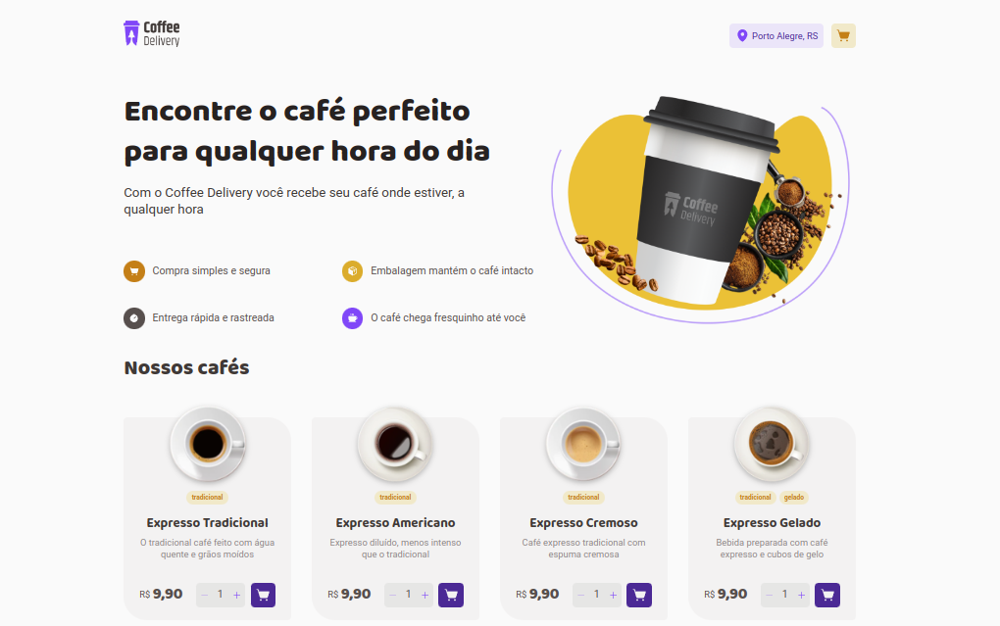
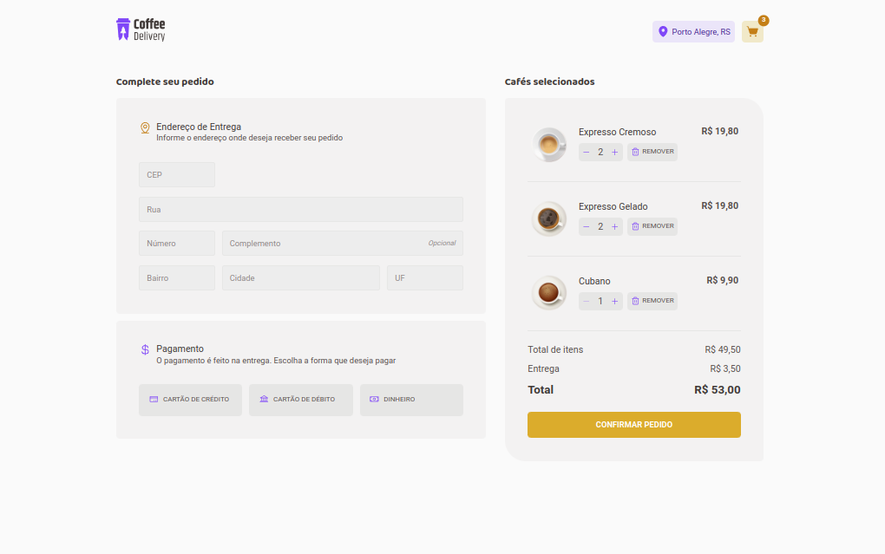
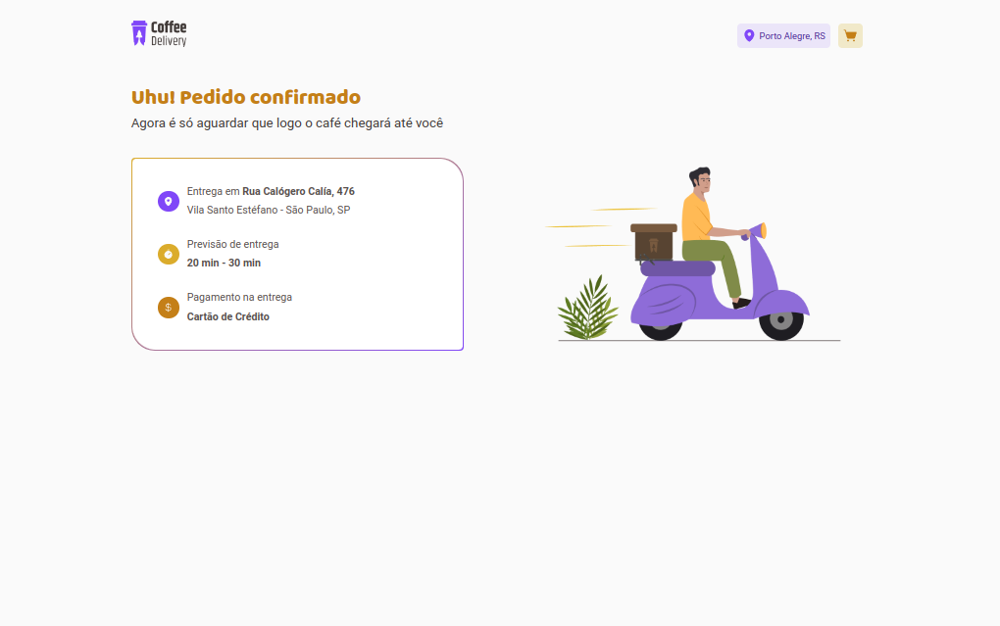

<!-- CABEÇALHO -->

    <h1>
        ☕ Coffee Delivery ☕
    </h1>
    

        <a href="#%EF%B8%8F-sobre-o-projeto">Sobre o Projeto</a> •
        <a href="#-funcionalidades">Funcionalidades</a> •
        <a href="#-layout">Layout</a> •
        <a href="#%EF%B8%8F-tecnologias">Tecnologias</a> •
        <a href="#-autor">Autor</a>
    

<!-- SOBRE O PROJETO -->

## 🖥️ Sobre o Projeto

        

 

> Projeto desenvolvido como desafio referente ao módulo Aprofundando em Hooks do curso de React.js da Rocketseat.

Esse projeto consiste em uma aplicação para gerenciar um carrinho de compras de uma cafeteria fictícia.

O objetivo deste desafio consistia em aprofundar nas funcionalidades do React e adicionar mais regras para praticar ainda mais as possibilidades desta tecnologia.

<!-- FUNCIONALIDADES -->

## 💡 Funcionalidades

- [x] Listagem de produtos (cafés) disponíveis para compra
- [x] Adicionar uma quantidade específicas de itens no carrinho
- [x] Aumentar ou remover a quantidade de itens no carrinho
- [x] Formulário para o usuário preencher o seu endereço
- [x] Exibir o total de itens no carrinho no Header
- [x] Exibir o valor total da soma de itens no carrinho multiplicados pelo valor

<!-- LAYOUT -->

## 🎨 Layout

> A aplicação tem como base o seguinte layout no [Figma](<https://www.figma.com/design/F7O27GeVtnj7HdEGAcMP44/Coffee-Delivery-%E2%80%A2-Desafio-React-(Copy)?node-id=2-12&t=wP28KEQymgzuE3JC-0>)

  
  
  

<!-- TECNOLOGIAS -->

## 🛠️ Tecnologias

Para o desenvolvimento desse projeto, as seguintes ferramentas foram utilizadas:

- **[Vite](https://vitejs.dev/)**
- **[React.js](https://pt-br.reactjs.org/)**
- **[TypeScript](https://www.typescriptlang.org/)**
- **[Styled Components](https://www.styled-components.com/)**
- **[React Router DOM](https://www.npmjs.com/package/react-router-dom)**
- **[React Hook Form](https://react-hook-form.com/)**
- **[Zod](https://zod.dev/)**

## 👨‍💻 Autor

Marcos Kenji Kuribayashi

 

---

Desenvolvido por Marcos Kenji Kuribayashi 😉
